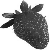

Fruits Classification using Cortex, Clojure-based Artificial Intelligence


# introduction

This was triggered and inspired by the post below:
http://gigasquidsoftware.com/blog/2016/12/27/deep-learning-in-clojure-with-cortex/

While the blog post is still very actual, and gives a nice description on how to get started with classification, the cortex code had been updated a bit, and so parts were needed an update, so this is a new classification example, this time based on fruits.

The goal of this exercice is to train a cortex network for classification, a network that can then differenciate between pictures of fruits, like coconut, apples, bananas etc … The cortex network will be trained with a large set of images and we will also see how to use the trained network in a simple manner.

The summary of this classification experiment is as below:

- first, convert the images, and prepare a given folder structure so that cortex can use the pictures via datasources in the next step ([prepare.clj](src/fruits/prepare.clj))
- train the network, using two datasources, one for training, and one for testing. ([training.clj](src/fruits/training.clj))
- use new external images to validate the trained network ([simple](src/fruits/simple.clj))

# image (data) download

A large amount of fruits images have already been gathered and put in the ([fruits/original](fruits/original)) folder. The original structure should be such that the name of the fruit appears in the file name. You can test with your own image files of course.

# prepare

The preparation phase consist of creating a set of folders of images, organized by their classification types, so one folder for apples, one folder for bananas etc ...

the image will first be resized to a smaller size for faster analysis, and also converted to grayscale before the training so colors does not get in the way of the training.
Remember the original picture set was created as images of fruits, with the name of the fruit being in the original file name.

With a first half of the original picture set, we will constitute a training folder, 
where the picture will be used tell the network to remember that this picture a mango, or a banana etc... explicitely.

With the second half of the original picture set, we will create a testing folder. The testing pictures  will be used to validate answers of the trained network with pictures, during the testing phase.

The main function is the preprocess-image function, that turn one of the original picture to a smaller size version in grayscale.

-  [idx [file label] ], unique index of the picture, source file, and a cat or dog label
-  output-dir, the top target folder
-  image-size, the new size of the target image

```
(defn preprocess-image
  "scale to image-size and convert the picture to grayscale"
  [output-dir image-size [idx [file label]]]
  (let [img-path (str output-dir "/" label "/" idx ".png" )]
    (when-not (.exists (io/file img-path))
      (io/make-parents img-path)
      (-> (imagez/load-image file)
          ((filters/grayscale))
          (imagez/resize image-size image-size)
          (imagez/save img-path)))))
```

The result of the prepare phase is to take all the pictures from the original folder,  and convert them to the given output. (given size, and grayscale). This gives the structure below:

```
.
├── original
├── testing
│   ├── apple
│   └── apricot
│   ...
└── training
    ├── apple
    └── apricot
    ...
      
```

Once the prepare phase is finished, testing and training folder are full of pictures like the ones below:

 

Note that the prepare part can be simply done with:

```
  (require '[fruits.prepare])
  (fruits.prepare/build-image-data  "fruits/original" 50)
```

where:
-  "fruits/original" is a folder containing the original pictures for training.
-  50 is the target size for the training and testing picture.

Once the preprocessing of images has been done, we can now go to the training network phase.

# training

For the training phase, we will setup two cortex datasources from the two folders that were prepared in the previous phase.
- training
- testing

Setting up a datasource is done with the experiment-util/create-dataset-from-folder function:

```
(require '[cortex.experiment.util :as experiment-util])
(def train-ds
 (-> training-folder
   (experiment-util/create-dataset-from-folder
     class-mapping :image-aug-fn (:image-aug-fn {}))
   (experiment-util/infinite-class-balanced-dataset)))
```

The initial description of the network has been kept identical as the mnist classification example:

```
(defn initial-description-preset [input-w input-h num-classes] 
    [(layers/input input-w input-h 1 :id :data)
     (layers/convolutional 5 0 1 20)
     (layers/max-pooling 2 0 2)
     (layers/dropout 0.9)
     (layers/relu)
     (layers/convolutional 5 0 1 50)
     (layers/max-pooling 2 0 2)
     (layers/batch-normalization)
     (layers/linear 1000)
     (layers/relu  :center-loss {:label-indexes {:stream :labels}
                   :label-inverse-counts {:stream :labels}
                   :labels {:stream :labels}
                   :alpha 0.9
                   :lambda 1e-4})
     (layers/dropout 0.5)
     (layers/linear num-classes)
     (layers/softmax :id :labels)])
```

Finally, the network can be trained using another function from the cortex.experiement.classification namespace. Parameters are:
- the description of the network
- the training datasource
- the testing datasource
- a function to convert picture to show on the simple webapp (started when the experiment is running)
- a class-mapping (to go back and forth between the categories in alphabet, and in digits)
- options ... (none here)

```
(classification/perform-experiment
    (initial-description image-size image-size num-classes)
    train-ds
    test-ds
    observation->image
    class-mapping
    {})
```

An easy way to run the training can be done using:

```
(require '[fruits.training])
(fruits.training/training "fruits/")
```
where *fruits/* is the folder containing the *testing* and *training* folders created in the previous *prepare* step.

From a shell, calling *leiningen*  directly from the command line also works.

```
lein run -m fruits.training "fruits/"
```

While the experiment is running, a small web application is started to confirm the status of the network training:

[http://localhost:8091](http://localhost:8091)

The images used, the confusion map, and the accuracy can all be checked visually in the web application:


On each training iteration the network will be checked against images from the testing folder, and will be given a score. If that score is higher than the previous iteration, then the updated network will be saved in the nippy file.


# use the network

The trained network is periodically saved to a file with a default name of trained-network.nippy.
The nippy file is mostlly only a binary version of a big clojure map. 
FIrst we load the network saved in a nippy  file:

```
(def nippy
  (util/read-nippy-file "trained-network.nippy"))
```

Then the main client function in simple.clj, is the guess function. It takes a loaded trained network, and an image-path and run the network with the converted input.

```
(defn guess [nippy image-path]
  (let[obs (image-file->observation image-path) ]
  (-> (execute/run nippy [obs])
   first
   :labels
   util/max-index
   index->class-name)))
```

The steps are explained below below:

1. convert the image to a compatible format (same size as network) and turn it into an observation, something that the network can act upon
2. make a run of the network. the input is an array of obervations
3. the return object is also an array, one result for each element of the input array. (so take the first element)
4. basically, each result is a score for each of the possible input, so util/max-index gets one of the possible categoies ("cat", "dog") and retrieve the one with the highest score


```
catsdogs.simple=> (guess nippy "resources/4-ways-cheer-up-depressed-cat.jpg")
; CUDA backend creation failed, reverting to CPU
; "cat"
```

The client part of the network can be used directly from the command line using *Leiningen*:

```
lein run -m fruits.simple samples/trained-fruits.nippy samples   
```
